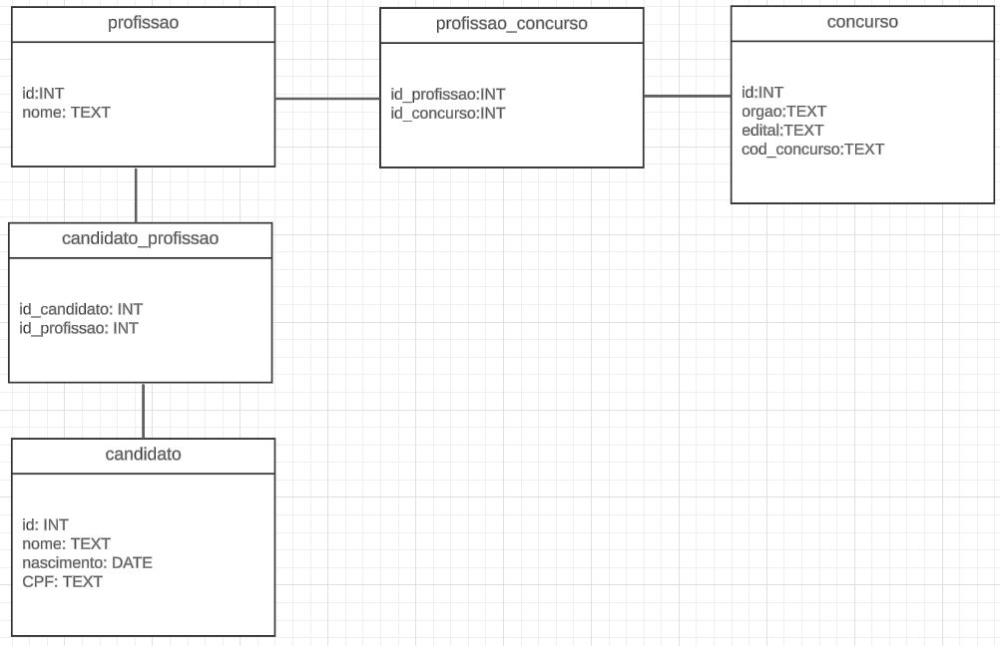

# LEDS- Processo seletivo:

# Diferenciais implementados:
-Tratamento de erros  
    Devido ao prazo apertado, foi implementado em todos os endpoints porém só testei nos endpoints que geram os relatórios pedidos pelo problema.  
-Implementação de serviço  
    Foi implementado um serviço hospedado em localhost:8080, a documentação dos endpoints e JSONs de exemplo estão no final do arquivo.  
    O Serviço foi estruturado separando a lógica de negócio da lógica de dados.  
    A lógica de negócio ficando na pasta /application e a logica de dados na pasta /model  
-Utilizar banco de dados  
    Foi utilizado um banco de dados MySQL hospedado pelo XAMPP.  
-Clean code  
    Segui tão bem quanto pude os 7 princípios de clean code.  
-Implementar o padrão de programação da tecnologia escolhida	
    segui as recomendações PSR-1 de codificação em PHP durante a implementação do sistema.  

# Descrição do problema:
Esse projeto tem como objetivo a geração de dois relatórios, sendo eles:
    - Todos os candidatos cadastrados no sistema que tem profissão compativel com esse concurso.
    - Todos os concursos cadastrados no sistema que tem profissão compativel com esse candidato.

Para isso, foram criadas 3 entidades, e 2 entidades de relacionamentos. Sendo elas, respectivamente: 

    candidato
        -id             (Int)
        -nome           (Text)
        -nascimento     (Date)
        -cpf            (Text)

    concurso
        -id             (Int)
        -orgao          (Text)
        -edital         (Text)
        -cod_concurso   (Text)

    profissao
        -id             (Int)
        -nome           (Text)

    candidato_profissao
        -id_profissao   (Int)
        -id_candidato   (Int)

    profissao_concurso
        -id_profissao   (Int)
        -id_concurso    (Int)

Eu decidi fazer a base de dados com mais tabelas de relacionamento do que necessário porquê dessa forma é possível  
economizar muito espaço na tabela profissao, removendo os registros que normalmente seriam repetidos.

# Documentação de Endpoints:
Cada uma das três entidades tem endpoints próprios para as suas funções de CRUD, eu criei também dois endpoints para associar as entidades, além disso, eu criei mais quatro endpoints.
Dois deles são para carregar a base de dados do txt para o banco de dados, e os outros dois são os relatórios que o desafio pede:  

    http://localhost/leds/backend/LEDS-Solucao/  
    application/  
        candidato/  
            create_candidato.php  
                POST data = {"nome":"renzo","cpf":"17684636707","nascimento":"2002/10/22"}  
            delete_candidato.php  
                POST data = {"id": 1}  
            read_all_candidato.php  
                GET  data = {}  
            read_candidato.php  
                GET  data = {"id":1}  
            update_candidato.php  
                POST data = {"id"=1,"nome":"renzo","cpf":"17684636707","nascimento":"2002/10/22"}  
        concurso/  
            create_concurso.php  
                POST data = {"orgao":"TJES", "edital":"SELECAO DE ESTAGIARIOS", "cod_concurso":"17222"}  
            delete_concurso.php  
                POST data = {"id":1}  
            read_all_concurso.php  
                GET  data = {}  
            read_concurso.php  
                GET  data = {"id"=1}  
            update_concurso.php  
                {"id":1,"orgao":"TRT","edital":"2022","cod_concurso":"321"}  
        profissao/  
            create_profissao.php  
                POST data = {"nome":"filosofo"}  
            delete_profissao.php  
                POST data = {"id":1}  
            read_all_profissao.php  
                GET  data = {}  
            read_profissao.php  
                GET  data = {"id":1 }  
            update_profissao.php  
                POST data = {"id":1,"nome":"coveiro"}  
        associar/  
            create_candidato_profissao.php  
                POST data = { "candidato":{ "id" : 1 }, "profissao": { "id" : 1 } }  
            create_profissao_concurso.php  
                POST data = { "concurso":{ "id" : 1 }, "profissao": { "id" : 1 } }  
        functions/  
            ler_arquivo_candidatos.php  
                POST  data = {}  
            ler_arquivo_concursos.php  
                POST  data = {}  
            relatorio_candidatos_compativeis.php  
                GET  data = {"cod_concurso":"61828450843"}  
            relatorio_concursos_compativeis.php  
                GET  data = {"cpf":"679.734.709-14"}  

