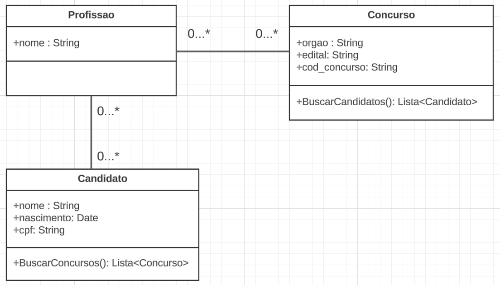

# LEDS- Processo seletivo:

# Diferenciais implementados:
-Tratamento de erros
-Implementação de serviço
-Utilizar banco de dados
-Implementar o padrão de programação da tecnologia escolhida	

# Descrição:
Esse projeto tem como objetivo a geração de dois relatórios, sendo eles:
    - Todos os candidatos cadastrados no sistema que tem profissão compativel com esse concurso.
    - Todos os concursos cadastrados no sistema que tem profissão compativel com esse candidato.

Para isso, foram criadas 3 entidades, e 2 entidades de relacionamentos. Sendo elas, respectivamente:
    candidato
        -id             (Int)
        -nome           (Text)
        -nascimento     (Date)
        -cpf            (Text)

    concurso
        -id             (Int)
        -orgao          (Text)
        -edital         (Text)
        -cod_concurso   (Text)

    profissao
        -id             (Int)
        -nome           (Text)

    candidato_profissao
        -id_profissao   (Int)
        -id_candidato   (Int)

    profissao_concurso
        -id_profissao   (Int)
        -id_concurso    (Int)

Eu decidi fazer a base de dados assim porquê dessa forma é possível economizar muito espaço na tabela profissao, removendo
os registros que normalmente seriam repetidos.

# Documentação de Endpoints:
Cada uma das três entidades tem endpoints próprios para as suas funções de CRUD, eu criei também dois endpoints para associar as entidades, além disso, eu criei mais quatro endpoints.
Dois deles são para carregar a base de dados do txt para o banco de dados, e os outros dois são os relatórios que o desafio pede.

Candidato
create_candidato.php
Método: POST
Dados: {"nome":"renzo","cpf":"17684636707","nascimento":"2002/10/22"}
delete_candidato.php
Método: POST
Dados: {"id": 1}
read_all_candidato.php
Método: GET
Dados: {}
read_candidato.php
Método: GET
Dados: {"id":1}
update_candidato.php
Método: POST
Dados: {"id":1,"nome":"renzo","cpf":"17684636707","nascimento":"2002/10/22"}
Concurso
create_concurso.php
Método: POST
Dados: {"orgao":"TJES", "edital":"SELECAO DE ESTAGIARIOS", "cod_concurso":"17222"}
delete_concurso.php
Método: POST
Dados: {"id":1}
read_all_concurso.php
Método: GET
Dados: {}
read_concurso.php
Método: GET
Dados: {"id":1}
update_concurso.php
Método: POST
Dados: {"id":1,"orgao":"TRT","edital":"2022","cod_concurso":"321"}
Profissao
create_profissao.php
Método: POST
Dados: {"nome":"filosofo"}
delete_profissao.php
Método: POST
Dados: {"id":1}
read_all_profissao.php
Método: GET
Dados: {}
read_profissao.php
Método: GET
Dados: {"id":1}
update_profissao.php
Método: POST
Dados: {"id":1,"nome":"coveiro"}
Associar
create_candidato_profissao.php
Método: POST
Dados: {"candidato":{"id":1},"profissao":{"id":1}}
create_profissao_concurso.php
Método: POST
Dados: {"concurso":{"id":1},"profissao":{"id":1}}
Functions
ler_arquivo_candidatos.php
Método: POST
Dados: {}
ler_arquivo_concursos.php
Método: POST
Dados: {}
relatorio_candidatos_compativeis.php
Método: GET
Dados: {"cod_concurso":"61828450843"}
relatorio_concursos_compativeis.php
Método: GET
Dados: {"cpf":"679.734.709-14"}
